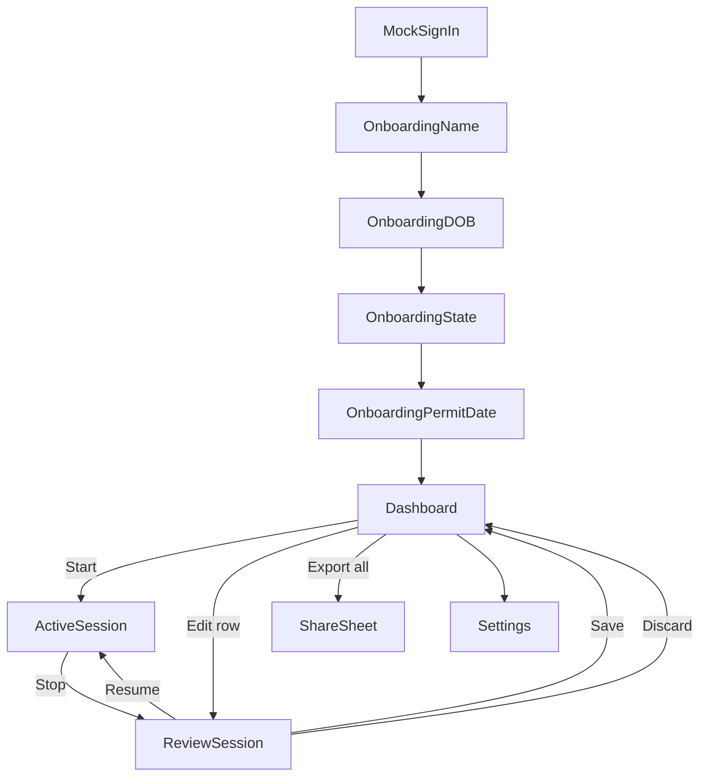

# Screens and navigation

**Last updated:** 2026-06-17  
Decisions: [DECISIONS.md](./DECISIONS.md)

---

## Phase 1 (MVP) — teen only

No role selection, no linking, no adult screens.

### Screen list

| Screen | Route (internal) | Purpose |
|--------|------------------|---------|
| Mock sign-in | `Auth/MockSignIn` | Phase 1 only; tap to create/load mock teen user |
| Onboarding — name | `Onboarding/Name` | Legal name |
| Onboarding — DOB | `Onboarding/DOB` | 13+ validation |
| Onboarding — state | `Onboarding/State` | IL default |
| Onboarding — permit date | `Onboarding/PermitDate` | **Required**; 9-month eligibility |
| **Dashboard** | `Home/Dashboard` | Progress 50/10, session list, Start, Export all |
| Active session | `Session/Active` | Elapsed timer, Stop |
| Review session | `Session/Review` | Edit notes, day/night display, Save / Discard / Resume |
| Settings | `Settings/Main` | Name, permit date, sign out, delete all data |

### Dashboard actions

| Action | Behavior |
|--------|----------|
| **Start** | If no active session → create `active` session → Active screen |
| **Edit** (row) | Open Review for saved session (reopen as draft) |
| **Export all** | Text/HTML of all saved, non-deleted sessions → share sheet |
| Progress bars | Total hours / 50; night hours / 10 |

### Review screen fields (editable)

- Start / end time (read-only in MVP after stop; display only)
- Duration (computed)
- Day / night (auto-computed; display + allow override post-MVP if needed — MVP display only)
- Notes (optional text)

---

## Phase 2 — adult + linking

See [ONBOARDING.md](./ONBOARDING.md) for full linking UX.

Additional screens:

| Screen | Role | Purpose |
|--------|------|---------|
| Role selection | Both | Teen vs adult |
| Adult onboarding | Adult | Name only |
| Invite code | Teen | Generate 6-digit code |
| Enter code | Adult | Accept link |
| Waiting for link | Both | Gate until linked |
| Adult dashboard | Adult | Selected teen context, pending approvals (see below) |
| Approval | Adult | Summary + attestation + Approve |
| Active session (adult) | Adult | "I'm with the driver", live stats |

Teen Save button label → **Submit for approval**.

### Adult dashboard — linked teen context (deferred)

When the adult dashboard shows session/approval data, it must be clear **which teen** is in view:

| Linked teens | UI |
|--------------|-----|
| **0** | Empty state + enter invite code (current placeholder) |
| **1** | Static label with teen name on dashboard — **no switcher** (list + remove live in linked-accounts section until switcher ships) |
| **2+** | Prominent selected-teen label + easy switch control (dropdown or equivalent) |

Switching teens updates all dashboard content scoped to that teen (approvals, active session, progress when added). Not built in the linking-only slice — implement when fleshing out adult dashboard / approvals.

### Teen Settings — linked accounts

Teen dashboard stays focused on progress. **Settings → Linked accounts**: list of linked adults (name + remove), **Invite adult** at the bottom.

### Adult Settings — linked accounts

Linked teens are managed in **Settings** (list, remove, link another teen) — not on the adult dashboard. Multi-teen **switcher** on the dashboard is deferred until session/approval UI ships.

---

## Navigation structure (Phase 1)

Stack navigator:

1. Auth stack (mock sign-in + onboarding) — until profile complete
2. Main stack: Dashboard (root), Active, Review, Settings

No tab bar required for MVP; optional later.

---

## Deep links (Phase 2)

Scheme: `boundfortheroad://` — see [CROSS_PLATFORM.md](./CROSS_PLATFORM.md).
