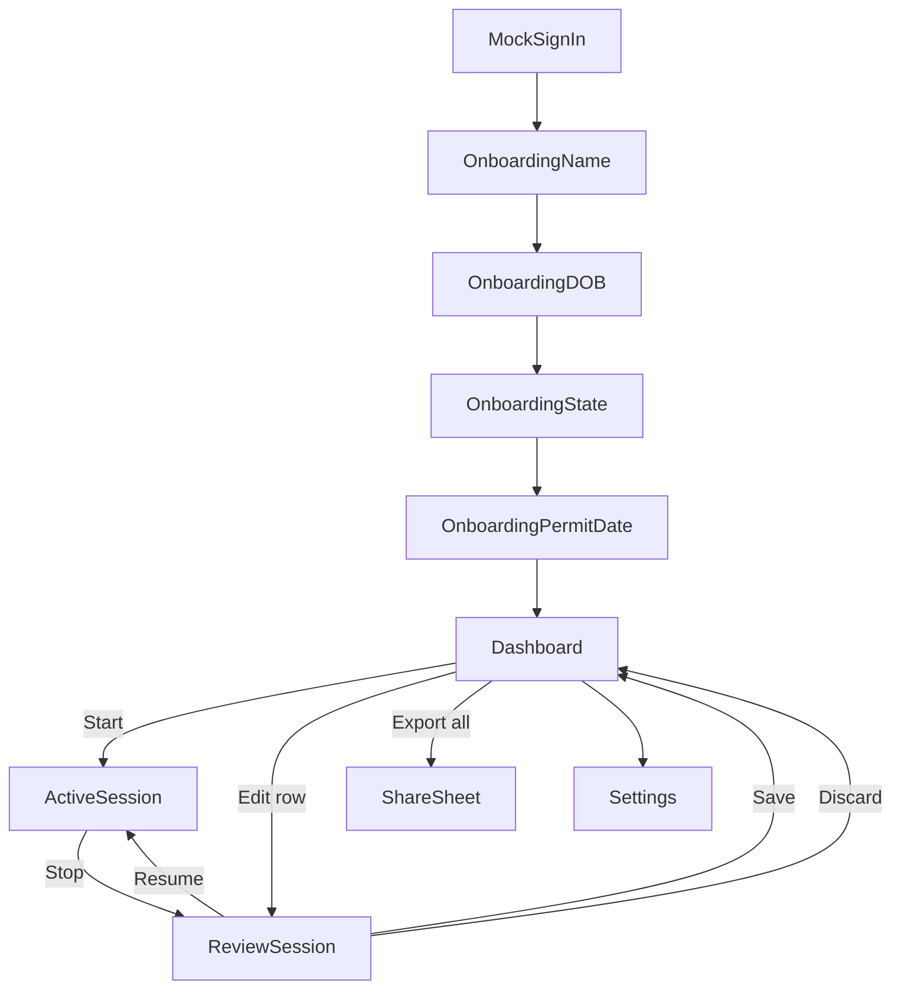

# Screens and navigation

**Last updated:** 2026-06-21  
Decisions: [DECISIONS.md](./DECISIONS.md)

---

## Phase 1 (MVP) — teen only

No role selection, no linking, no adult screens.

### Screen list

| Screen | Route (internal) | Purpose |
|--------|------------------|---------|
| Mock sign-in | `Auth/MockSignIn` | Phase 1 only; tap to create/load mock teen user |
| Onboarding — name | `Onboarding/Name` | Legal name |
| Onboarding — DOB | `Onboarding/DOB` | 13+ validation |
| Onboarding — state | `Onboarding/State` | IL default |
| Onboarding — permit date | `Onboarding/PermitDate` | **Required**; 9-month eligibility |
| **Dashboard** | `Home/Dashboard` | Progress 50/10, session list, Start, Export all |
| Active session | `Session/Active` | Elapsed timer, live road category + day/night (foreground GPS), Stop |
| Review session | `Session/Review` | Edit start/end, notes; duration + day/night computed; Save / Discard / Resume |
| Settings | `Settings/Main` | Name, permit date, sign out, delete all data |

### Dashboard actions

| Action | Behavior |
|--------|----------|
| **Start** | If no active session → create `active` session → Active screen |
| **Edit** (row) | Open Review for saved session (reopen as draft) |
| **Export all** | Text/HTML of all saved, non-deleted sessions → share sheet |
| Progress bars | Total hours / 50; night hours / 10 (both use theme accent) |

### Review screen fields (draft or edit)

| Field | Editable | Notes |
|-------|----------|-------|
| Start / end time | Yes (draft review, Edit session) | `DateTimePickerField` |
| Duration | No | Computed from start/end |
| Day / night | No | Computed from start time |
| Notes | Yes | Optional text |

Re-submit after editing a saved session: reopen as draft → save → existing submit / re-approval flow.

### Active session — foreground location (Expo Go)

While the app is **foreground** and the session is active:

- Request **when-in-use** location permission (first session only)
- Sample coords + speed on an interval; store locally in `session_location_samples` (device-only, not synced)
- Show live **road category** heuristic (local vs highway from speed) and day/night icon
- Review shows local/highway/not-tracked breakdown when GPS samples exist; stored on session stop/save
- No sampling when the app is backgrounded (background track requires dev build)

---

## Phase 2 — adult + linking

See [ONBOARDING.md](./ONBOARDING.md) for full linking UX.

Additional screens:

| Screen | Role | Purpose |
|--------|------|---------|
| Role selection | Both | Teen vs adult vs **instructor** |
| Adult onboarding | Adult | Name only |
| Instructor onboarding | Instructor | Name → enter teen invite code (same as adult link) |
| Invite code | Teen | Generate 6-digit code |
| Enter code | Adult / Instructor | Accept link |
| Waiting for link | Both | Gate until linked |
| Adult dashboard | Adult | Selected teen context, pending approvals (see below) |
| **Instructor dashboard** | Instructor | **School name header**; all students listed with pending sessions nested under each name (see below) |
| Approval | Adult / Instructor | Summary + attestation + Approve / send back |
| Active session (adult) | Adult | "I'm with the driver", live stats |

Teen Save button label → **Submit for approval**.

### Adult dashboard — linked teen context

When the adult dashboard shows session/approval data, it must be clear **which teen** is in view:

| Linked teens | UI |
|--------------|-----|
| **0** | Empty state + enter invite code |
| **1** | Static label: “Viewing: {name}” |
| **2+** | Horizontal name chips; selected chip uses theme accent |

Switching teens updates progress bars and pending/approved session lists for that teen only. Selection persists per adult account (`adult_selected_teen_id_<adultUserId>`).

After accepting an invite code, the adult returns to **Adult dashboard** with the newly linked teen selected.

### Teen Settings — linked accounts

Teen dashboard stays focused on progress. **Settings → Linked accounts**: list of linked adults (name + remove), **Invite adult** at the bottom.

### Adult Settings — linked accounts

Linked teens are managed in **Settings** (list, remove, link another teen) — not on the adult dashboard. Multi-teen **switcher** on the dashboard is deferred until session/approval UI ships.

### Instructor dashboard — student-grouped approvals

**Not** the adult layout (no teen switcher, no progress summary). See [DRIVING_SCHOOLS.md](./DRIVING_SCHOOLS.md#instructor-dashboard-v1--decided).

| Element | Behavior |
|---------|----------|
| **Header** | Affiliated **school name** (or “Instructor dashboard” if none yet) |
| **List** | Every linked student; **pending sessions nested under** that student’s name (**newest session first** under each student, both sort modes) |
| **Sort** | **Alphabetical** (all students A→Z) or **Newest pending** (students with pending first, by latest submit); **sessions under each student always newest first** |
| **Row tap** | Opens **Approve session** (same screen as adult) |
| **Empty** | No linked students → empty state + enter invite code |

Instructor **Settings** mirrors adult where applicable (linked accounts, sign out); school affiliation managed via web invite (later phase).

---

## Navigation structure (Phase 1)

Stack navigator:

1. Auth stack (mock sign-in + onboarding) — until profile complete
2. Main stack: Dashboard (root), Active, Review, Settings

No tab bar required for MVP; optional later.

---

## Deep links (Phase 2)

Scheme: `boundfortheroad://` — see [CROSS_PLATFORM.md](./CROSS_PLATFORM.md).
