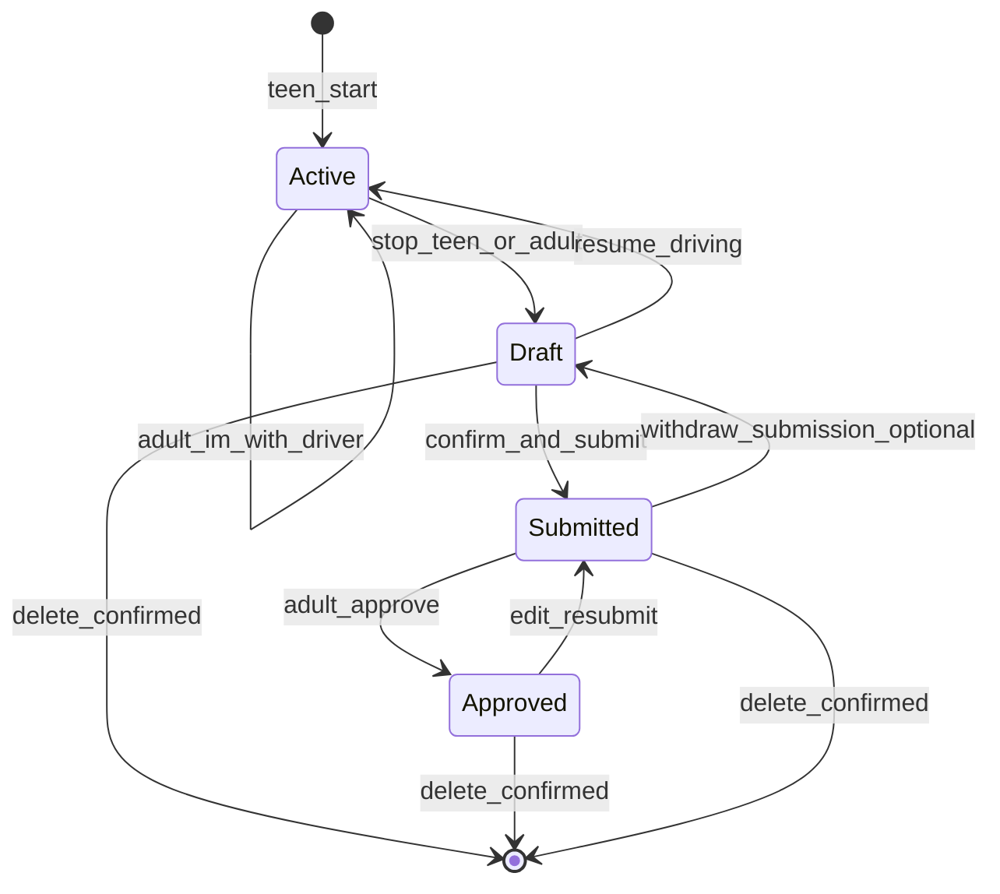

# Session Lifecycle

## Concepts

| Term | Meaning |
|------|---------|
| **Session** | One supervised practice drive from Start until finalized or deleted. |
| **Active supervisor** | Adult who tapped **“I’m with the driver”** for this session. |
| **Draft** | Post-stop, pre-submit; mutable, no hash. |
| **Submitted** | Frozen payload with `requestHash`; awaiting approval. |
| **Approved** | An approval record exists for that `requestHash`. |

## Who can do what (active session)

| Action | Teen | Joined adult | Other linked adults |
|--------|------|--------------|---------------------|
| Start | Yes | No | No |
| “I’m with the driver” | No | Yes (once per session) | Yes (first claim wins) |
| View live stats | Yes | Yes | No (until wishlist: read-only?) |
| Stop | Yes | Yes (with confirm) | No |
| Stall prompts | Yes | Yes | No |

After stop, only **teen** completes review (Confirm / Resume / Delete) unless product later adds parent draft edit pre-submit.

## State machine

## Flow detail

### 1. Start

- Teen taps **Start** before or while parked (discourage use while moving).
- Session `status = active`.
- Push: all linked adults (MVP); wishlist: proximity subset.
- Lock screen / ongoing notification: elapsed time, day/night indicator, **Stop** only.

### 2. Join in progress

- Adult receives start notification.
- Adult taps **“I’m with the driver”** → `activeSupervisorId` set.
- Other adults: optional “Session claimed by [Name]” — no ongoing stop/stall alerts.
- Adult app shows live stats (duration, day/night split so far, etc.).

### 3. During drive

- **No** summary UI on Live Activity / notification beyond timer + stop.
- Stall: no movement ≥ N minutes (default 10, settings) → **End** | **Still driving**.
- Geofence home hint: wishlist.

### 4. Stop

**Teen:** Stop on lock screen → device opens app to **review** screen.

**Adult:** Confirm stop → timer ends → teen push: complete review in app.

### 5. Review (draft)

| Button | Behavior |
|--------|----------|
| **Confirm** | Finalize draft fields; show **Submit for approval**. |
| **Resume driving** | Return to `active`; clear stall timers. |
| **Delete** | Destructive confirmation → remove session. |

### 6. Submit

- Build canonical payload → `requestHash = SHA-256(canonical JSON)`.
- Notify adult(s) per [NOTIFICATIONS.md](./NOTIFICATIONS.md).
- `status = submitted`.

### 7. Approve

- Adult sees summary (time, tags).
- One tap **Approve** binds to `requestHash`.
- If adult did **not** join session: require **supervisor in vehicle** name OR **“I was with them”** (approver’s legal name).
- `status = approved` (for that hash).

### 8. Edit and delete

- **Edit after approve:** new submit → new hash → must approve again; old approval remains on old hash (historical).
- **Delete:** teen (and policy for adult?) with confirm—any state including approved.

## Parent stop vs teen stop

| | Teen stop | Adult stop |
|--|-----------|------------|
| Ends timer | Yes | Yes |
| Opens teen review | Yes (explicit) | Yes (teen notified) |
| Teen must confirm stop | No | No |
| Adult confirm | N/A | Yes |

## Teaching responsibility

- Teen **starts** practice logging.
- Teen **reviews** auto tags and **submits** for approval.
- Adult **joins** when actually supervising (honesty + accurate “who was with driver”).
- Adult **approves** what they agree is accurate—or edits per policy → new hash.
