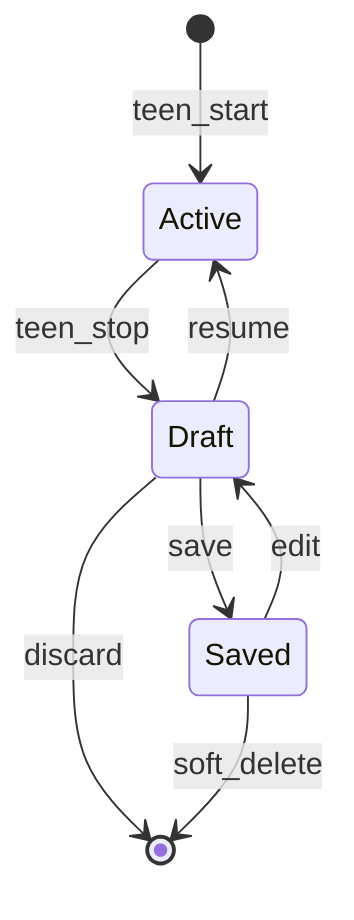
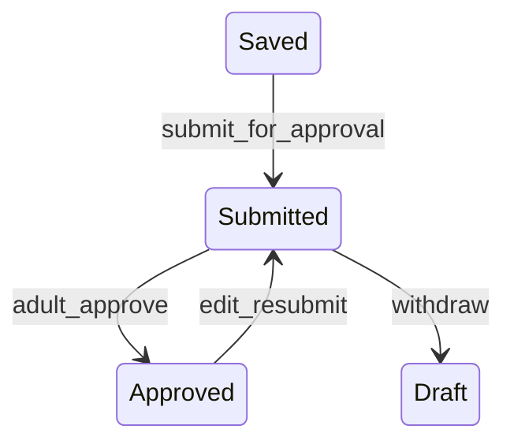

# Session Lifecycle

Decisions: [DECISIONS.md](./DECISIONS.md)

---

## Phase 1 (MVP) — teen only

### Concepts

| Term | Meaning |
|------|---------|
| **Session** | One practice drive from Start until saved, discarded, or soft-deleted. |
| **Draft** | Post-stop, pre-save; mutable. |
| **Saved** | Completed record with `requestHash`; counts toward progress. |

### State machine

### Who can do what (Phase 1)

| Action | Teen |
|--------|------|
| Start | Yes |
| Stop | Yes |
| Review Save / Discard / Resume | Yes |
| Edit saved (dashboard) | Yes |
| Soft-delete saved | Yes |

### Flow

1. **Start** — `status = active`; schedule 2-hour local nudge ([NOTIFICATIONS.md](./NOTIFICATIONS.md)).
2. **Stop** — pause timer; `status = draft`; open Review screen.
3. **Review** — show duration, day/night, notes; warn if &lt; 5 min on Save.
4. **Save** — compute hash, `status = saved`; cancel nudge.
5. **Discard** — delete draft row (never saved).
6. **Edit** (from dashboard) — `saved` → `draft`; clear hash until re-save.

---

## Phase 2 — multi-actor (future)

Full design retained for implementation later.

### Additional concepts

| Term | Meaning |
|------|---------|
| **Active supervisor** | Adult who tapped **“I’m with the driver”**. |
| **Submitted** | Frozen hash awaiting approval. |
| **Approved** | Approval record for `requestHash`. |

### Additional states

- Adult **join** in progress; adult **stop** (post-MVP per [WISHLIST.md](./WISHLIST.md)).
- Push on start, submit, approve — [NOTIFICATIONS.md](./NOTIFICATIONS.md) Phase 2 section.

See [ONBOARDING.md](./ONBOARDING.md) for linking gates.
